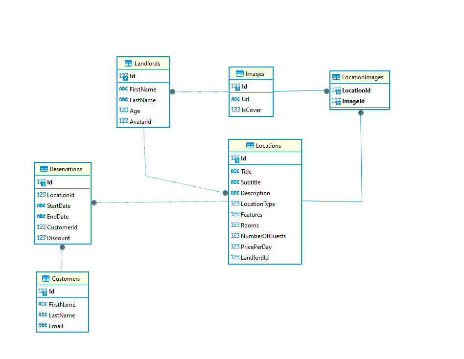

# Cloud BnB API

This is an implementation of the API behind [cloudbnb](https://cloudbnb-df3c1.web.app/). If you run this API at port 7279, you should be able to see the website function.

## Setup
Before you run the API, you need to create a database. This can be done by executing the following command in the Nuget Package manager console: `update-database`.

This execute two migrations. The first will create the database, tables, and relations. The second will populate the database with testing data. If you do not want the population data, you can manually delete the file Migrations/20240318193237_Population.cs

## Extra's
>Creativiteit, (becommentarieerde) eigen inbreng, optionele onderdelen, Validation, Exception Handling, etc. Laat specifiek in comments weten of er speciaal toegevoegde dingen zijn die aandacht verdienen.

1) **Custom ERD** 
A custom ERD has been created and used (details can be found [here](#erd)).  
This allows for a better relation between Location and Image.
2) **ImgurService** 
There is an ImgurService, handling file uploads to an external image server.  
The /api/locations/upload endpoint works with this service, and also automatically links it to a specific location.
3) **CrudRepository** 
Instead of manually creating repositories for each entity, I created a generic repository that handles all crud operations. Each entity has a repository that inherits from this abstract class, and passes along the minumum data. This repository can only be used for an entity that inherits from IIdentifiable,
4) **HTTP file** 
For testing purposes, I have included a http file. This file contains all* endpoints used and enables you to test them easily. If the API is running, you can press "Send request" and you will get the result

*Except the Image uploading endpoint. There is no (easy) way to send a FormFile with this method.

## ERD
Here is an ERD that shows the currently used database. It differs from the original given design. This was done to allow a one-to-many relation between Location and Image, who now have the LocationImage table. The alternative was giving the Image table an optional reference to Location, which was an undesired result. This method also allows more flexible references with other tables like Landlord.

